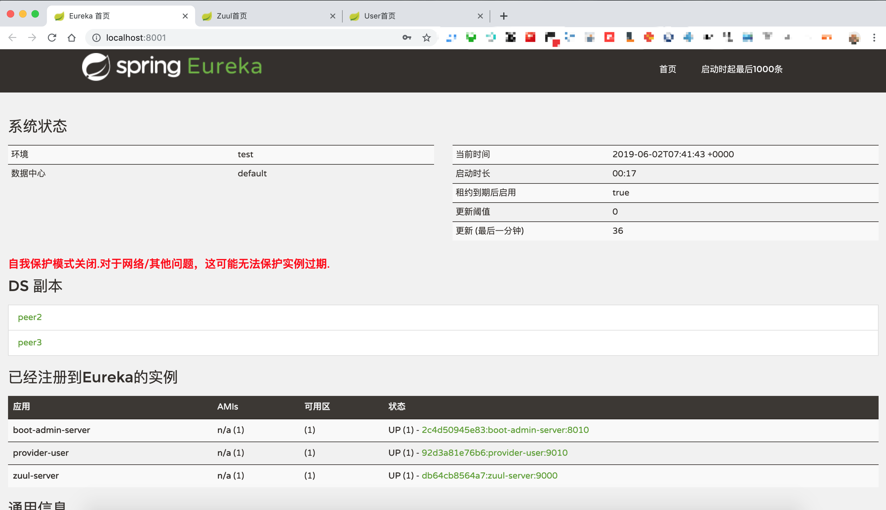

# well-cloud-shop

[参考地址](https://www.cnblogs.com/fcml/p/10162832.html)

```
# 创建一个名为cloud的桥接网络
docker network create -d bridge cloud    

# 依次启动三个镜像，并且连接到创建的cloud网络上
docker run -d --name well-eureka-1.0.0 -p 8761:8761 --network cloud com.zxk175/well-eureka:1.0.0

docker run -d --name well-zuul-1.0.0 -p 8800:8800 --network cloud com.zxk175/well-zuul:1.0.0

docker run -d --name well-boot-admin-1.0.0 -p 9000:9000 --network cloud com.zxk175/well-boot-admin:1.0.0
```

## 使用docker-compose

```
sh docker-up.sh 
```

## Zuul首页


## Zuul Swagger
